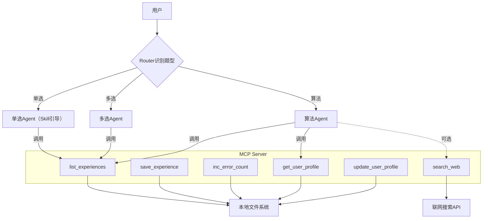

# 考试经验沉淀系统 - 设计稿

> 状态：已实现 | 创建日期：2026-06-15 | 实现日期：2026-06-15

## 1. 概述

本系统用于在练习阶段（单选/多选/算法题）自动沉淀个人经验、错误模式及正确解法，并通过 **MCP + Skill** 组合实现跨模型（Claude / Mimo / Step）的持久化记忆与智能检索。系统轻量化，基于本地文件存储，支持分题型上下文控制、用户画像自动推断和联网补充查询。

**核心目标**：
- 自动记录用户的错题与经验，按题型和知识点分类。
- 在后续对话中仅加载最相关的 3~5 条经验，避免上下文过长。
- 从自然对话中推断用户画像（强弱项、偏好），用于个性化解答。
- 支持手动/自动将经验写入文件，并累计错误次数。
- 练习阶段可选联网搜索补充资料。

## 2. 整体架构



**说明**：
- 用户与同一个模型实例对话，但由 Skill 中的"角色切换"规则模拟不同 Agent（实际仍是同一个模型，通过提示词控制其行为聚焦）。
- MCP Server 提供原子化工具，供模型调用。
- 本地文件系统是唯一持久化层，无需数据库。

## 3. 组件详细设计

### 3.1 MCP Server

**技术栈**：Python 3.10+，使用 `mcp` 库（或自行实现 stdio 协议）。
**启动方式**：通过 `uv run` 或直接 `python server.py`。
**配置文件**（Claude Desktop 示例）：
```json
{
  "mcpServers": {
    "exam-memory": {
      "command": "python",
      "args": ["/path/to/exam_memory/server.py"],
      "env": {}
    }
  }
}
```

**工具定义**：

| 工具名 | 输入参数 | 输出 | 说明 |
|--------|----------|------|------|
| `list_experiences` | `type` (string), `limit` (int, 默认5) | `string[]` 经验内容列表 | 按题型过滤，按 `error_count` 降序返回前 `limit` 条。 |
| `save_experience` | `title`, `content`, `type`, `knowledge`, `difficulty` | `bool` 成功/失败 | 创建新文件，自动编号。 |
| `inc_error_count` | `file_path` | `bool` | 增加指定经验文件的 `error_count`。 |
| `get_user_profile` | 无 | `object` 完整画像 | 读取 `user_profile.json`。 |
| `update_user_profile` | `diff` (object) | `bool` | 合并更新画像（只修改提供的字段）。 |
| `search_web` | `query` | `string` 搜索结果摘要 | 调用 DuckDuckGo Lite API。 |

**实现要点**：
- 经验文件存放在 `~/exam_memory/experiences/`，文件名格式：`[类型]_[知识点]_[序号].md`，序号自动递增（扫描目录最大序号+1）。
- `list_experiences` 解析每个 Markdown 文件的 frontmatter（YAML），提取 `error_count`，按降序排序后返回文件内容的全文。
- 使用 `threading.Lock` 保证文件写入原子性（简单场景可忽略）。

**关键代码骨架**（`server.py`）：

```python
import os, json, glob, yaml
from mcp.server import Server, NotificationOptions
from mcp.server.models import InitializationOptions
import mcp.server.stdio

async def main():
    server = Server("exam-memory")

    @server.list_tools()
    async def handle_list_tools():
        return [
            {"name": "list_experiences", "description": "按类型列出经验",
             "inputSchema": {"type": "object", "properties": {
                 "type": {"type": "string", "enum": ["单选题", "多选题", "算法"]},
                 "limit": {"type": "integer", "default": 5}}}},
            # ... 其他工具类似
        ]

    @server.call_tool()
    async def handle_call_tool(name: str, arguments: dict):
        if name == "list_experiences":
            exp_type = arguments["type"]
            limit = arguments.get("limit", 5)
            files = glob.glob(f"experiences/{exp_type}_*.md")
            items = []
            for f in files:
                with open(f, "r") as fp:
                    content = fp.read()
                    if "---" in content:
                        front = content.split("---")[1]
                        data = yaml.safe_load(front)
                        err = data.get("error_count", 0)
                    else:
                        err = 0
                    items.append((err, content))
            items.sort(reverse=True)
            return {"content": [{"type": "text", "text": "\n---\n".join([c for _,c in items[:limit]])}]}
        # 实现其余工具...

    async with mcp.server.stdio.stdio_server() as (read_stream, write_stream):
        await server.run(read_stream, write_stream, InitializationOptions(...))

if __name__ == "__main__":
    import asyncio; asyncio.run(main())
```

### 3.2 Skill 定义

Skill 是一个 Markdown 文件（`skills/exam-assistant.md`），内容如下：

```markdown
---
name: exam-assistant
description: 考试经验沉淀助手，自动检索历史经验，支持用户画像。
tools: [list_experiences, save_experience, inc_error_count, get_user_profile, update_user_profile, search_web]
---

# 身份
你是考试辅助 AI，集成了用户本人的个人经验库。你必须严格遵循以下工作流，并在每次回答时体现对历史经验的利用。

# 工作流规则

## 1. 题型识别与经验加载
- 用户发送题目后，判断类型：**单选题**、**多选题** 或 **算法题**。
- 立即调用 `list_experiences` 工具，传入对应类型，`limit=5`。
- 将返回的经验作为"先前记忆"融入思考，并在回答开头注明："📚 根据您过往经验：" 并简略引用。

## 2. 解答格式
- 先给出明确答案（对于选择题，直接选项+解释）。
- 对于算法题，提供思路、复杂度分析、代码（优先使用用户偏好语言，从画像中获得）。
- 若经验中存在类似错误模式，主动提醒："您曾在此类问题上犯过 X 错误，本次应当注意 Y。"

## 3. 错误记录与经验更新
- 如果用户指出自己写错了，或模型发现用户解答有明显错误：
  - 分析错误类型，判断是否与已有经验匹配。
  - 若匹配，调用 `inc_error_count` 增加该经验的错误次数。
  - 若不匹配，询问用户："本次错误是一种新模式，是否存入经验库？"
  - 用户确认后，调用 `save_experience`，参数中 `content` 应包含：错误理解、正确解法、知识点标签。
- 当用户说"记录本题"或"记住这个解法"时，直接调用保存。

## 4. 用户画像管理
- 在对话开始时，调用 `get_user_profile` 获取画像。
- 画像影响解答风格：例如若 `skip_basic_explanation` 为 true，则省略基础概念讲解。
- 对话结束后（用户说"结束练习"或长时间无输入），自动触发画像更新：分析本次对话中用户的语句，识别：
  - 明确表达"我总是错在…"、"我不懂…" → 对应知识点弱点 +1
  - "这个太简单了"、"秒杀" → 对应知识点强项 +1
  - "以后不用讲基础"、"直接给代码" → 更新 `preferences`
  - 调用 `update_user_profile` 传入变更 diff。

## 5. 联网查询（可选）
- 仅在用户明确要求时执行，例如："帮我查一下背包问题的优化解法"。
- 调用 `search_web`，将结果摘要呈现给用户。
- 联网结果不自动保存，用户可手动决定是否提取有用点存入经验。

## 6. 上下文长度控制
- 严格遵守 `limit=5`，禁止一次性加载过多经验。
- 如果经验文件内容本身过长（超过 500 字），模型应在读取后自动摘要关键点，不直接全文粘贴到回答中。

## 7. 示例对话流程
（此处可省略，留给用户测试时自然形成）
```

### 3.3 本地存储格式

#### 经验文件（Markdown + frontmatter）
文件示例：`算法_双指针_001.md`
```markdown
---
type: 算法
knowledge: 双指针
difficulty: 中等
error_count: 2
created: 2025-01-15
last_review: 2025-01-20
---

## 我的错误理解
以为双指针只能用于有序数组，忽略了快慢指针在链表中的应用。

## 正确解法要点
- 双指针常见模式：相向指针（两数之和）、快慢指针（环形链表）、滑动窗口（最长子串）。
- 复杂度 O(n) 空间 O(1)。

## 典型例题
[LeetCode 15 三数之和](...)
```

**字段说明**：
- `type`：单选题/多选题/算法
- `knowledge`：知识点名称（如"时间复杂度"、"动态规划"）
- `difficulty`：简单/中等/困难
- `error_count`：累计错误次数（初始 0）
- `created`：创建日期
- `last_review`：最后复习日期（可选，用于后续间隔重复）

#### 用户画像（`user_profile.json`）
```json
{
  "preferences": {
    "preferred_language": "Python",
    "skip_basic_explanation": false,
    "likes_diagrams": true
  },
  "strengths": {
    "array": 3,
    "two_pointers": 2
  },
  "weaknesses": {
    "dynamic_programming": 4,
    "bit_manipulation": 1
  },
  "recent_focus": "graph",
  "last_updated": "2025-01-15T10:30:00Z"
}
```
- 强弱项用整数表示频次/严重程度（0-5）。
- 画像由模型在每次对话后增量更新，无需人工干预。

## 4. 工作流程示例（用户练习一道算法题）

1. **用户**：`（粘贴算法题）给定一个数组，找出三数之和为零的所有组合，用双指针解。`
2. **模型（内置Skill）**：
   - 识别类型：算法题。
   - 调用 `list_experiences(type="算法", limit=5)`，返回内容包含 `算法_双指针_001.md` 等。
   - 调用 `get_user_profile` 获取偏好语言（Python）。
   - 回答开头："📚 您曾对双指针犯过'忽视快慢指针'的错误，本题需要三指针变形，注意边界。"
   - 写出 Python 解法并解释。
3. **用户**：`我写的代码超时了，帮忙看看。（贴出错误代码）`
4. **模型**：分析错误原因（例如内层循环写成了 O(n²)），判断是否与已有经验匹配？若不匹配：
   - "本次错误（未去重导致重复组合）是新模式，是否存入经验库？"
5. **用户**：`存一下`
6. **模型**：调用 `save_experience`，生成新文件 `算法_双指针_002.md`，内容包含错误点和正确优化。
7. **对话结束** 用户说"结束练习"。
8. **模型**：自动分析本次对话：
   - 用户未表现出明显弱项变化 → 画像不变。
   - 但用户回答了"是的，我总是忘记去重" → 更新 `weaknesses["去重"]` 增加 1。
   - 调用 `update_user_profile`。

## 5. 实现步骤（从零到运行）

1. **创建目录结构**
   ```bash
   mkdir -p ~/exam_memory/experiences
   touch ~/exam_memory/user_profile.json
   ```

2. **编写 MCP Server**（约150行 Python）
   参考上面代码骨架，实现全部工具。注意使用 `mcp` 库（需安装 `mcp[cli]`）。

3. **编写 Skill 文件**
   将上述 `exam_assistant.md` 保存到本地（路径任意）。

4. **配置 Claude Desktop**
   添加 MCP Server 配置，重启 Claude。

5. **测试**
   - 在 Claude 中新建对话，点击 "Attach from MCP" 选择 exam-memory（或直接使用，因为工具会自动列出）。
   - 手动粘贴 Skill 内容到对话框，或使用 Claude 的 "Add Skill" 功能（如果支持）。
   - 开始练习，观察是否调用工具、是否正确读写经验文件。

6. **跨模型使用**（如 Mimo/Step）
   - 将 Skill 内容作为系统提示（或人工粘贴到对话开头）。
   - 由于这些模型可能不支持 MCP，需使用本地脚本模拟 MCP 工具调用（或简化版本：手动维护经验文件，模型通过读取文件来获取经验）。但建议优先在支持 MCP 的客户端（如 Claude Desktop、Cursor）中使用。

## 6. 后续可选优化

- **间隔重复提醒**：在 `list_experiences` 中增加按 `last_review` 排序，优先展示长期未复习的经验。
- **向量检索**：将经验条目标题和内容向量化，支持语义搜索（替代简单的类型+错误次数排序）。
- **自动拆分长文档**：当单个经验文件超过 1000 字，触发模型提示用户拆分。
- **联网资料自动总结并记录**：允许用户将搜索到的知识点一键存入经验库。

## 7. 常见问题

**Q：如何保证不同题型经验不混淆？**
A：`list_experiences` 严格按 `type` 参数过滤，且文件名前缀区分了题型。

**Q：模型会不会忘记调用工具？**
A：Skill 中明确写了工作流规则，并且工具列表已提供给模型；Claude 3.5 Sonnet 及之后版本对工具调用遵从度较高。

**Q：用户画像更新是否过于激进？**
A：只在用户明确说"结束练习"或长时间无输入时才触发；用户也可手动输入"更新画像"来触发。

**Q：需要网络才能用吗？**
A：不需要。联网搜索是可选功能，默认不启用；若不配置搜索 API，工具会返回"未配置"。

## 8. 总结

本设计稿提供了一个**可立即落地的轻量级考试经验沉淀系统**，核心是：
- 一个 MCP Server 提供文件读写、检索、画像管理能力。
- 一个 Skill 文件定义工作流，引导模型按题型加载经验、记录错误、更新画像。
- 本地纯文本存储，易于备份和手动编辑。

按照上述步骤实现后，将拥有一个**跨模型、自进化、低上下文**的个人考试助手。
